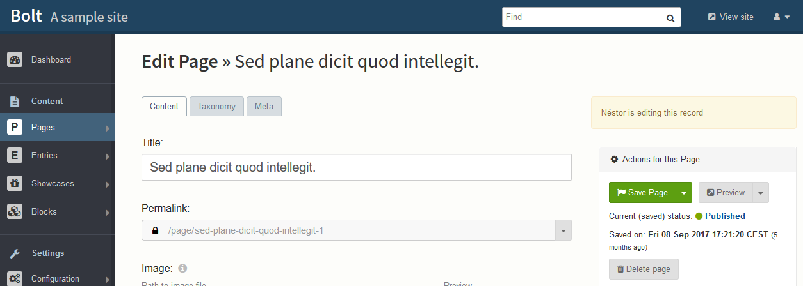

Who Is Editing Bolt Extension
======================

This is an extension for Bolt CMS that informs/alerts the editor that others are editing the same content at the same time.
Do note, however, that it does *not* prevent people from editing and saving.

### How to configure?

__Important!__
After installation run a database update (Configuration -> Check database -> Update the database).  

### How it works?

After installing the extension, you will see a message on the top-right side of the edit content page when others are editing or have edited the record you are viewing.

